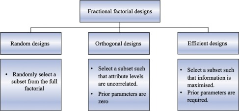
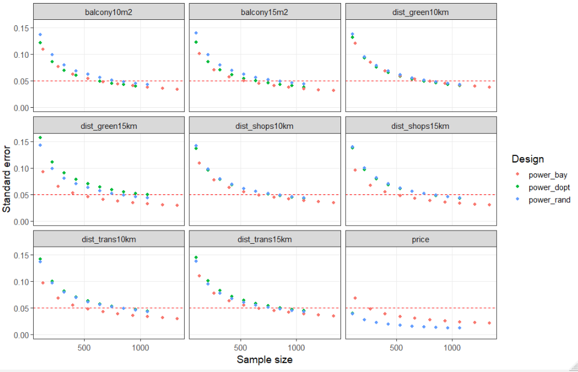

```{r setup, include=FALSE}
knitr::opts_chunk$set(echo = TRUE)
```

$~$

# Notes

*  Take the <font size="5"> [TEST SURVEY](https://www.reloc-age.org/dce) </font>. 


* See the preliminary <font size="5"> [FEEDBACK](#feedback)  </font> from pilot tests.
 
 
* Structure of the document is now oriented towards our specific project. Detailed explanations of attributes, levels, etc., can be found in the [Appendix](#appendix).

* A working document with the beginning of a potential 
[Discrete choice](https://github.com/n-christie/ahrg_reloc_age_dce/blob/main/latex/elsvier/reloc_age_prospectus.pdf?raw=true) paper.


$~$

# Feedback

## Descriptive data

```{r echo=FALSE, message=FALSE, warning=FALSE, out.width="100%"}
# Load libraries and data

library(pacman)

p_load(tidyverse, here, stringr, formr, logitr, cbcTools, texreg, likert, tidyr, haven, kableExtra, sjlabelled, summarytools)

# load data


survey_design <- readRDS("data/survey_design_swe.rds")
survey_df <- readRDS("data/first_pilot.rds")


```


```{r echo=FALSE, message=FALSE, warning=FALSE, out.width="100%"}
dfSum <- survey_df %>% 
  select(monthcost,income, time_page_1,time_page_2,time_page_3,time_page_4,time_page_feed, user_exp = feedback_button01, content = feedback_button02)%>% 
  mutate(cbc_time = if_else(is.na(time_page_4),time_page_3,time_page_4) ,
           total_survey_time = rowSums(across(c(time_page_1,time_page_2,cbc_time))) ,
         feed_back_time = time_page_feed ) %>% 
  as.data.frame()

dfSum <- dfSum %>% 
  mutate(cbc_time = cbc_time/60,
         total_survey_time =total_survey_time/60,
         feed_back_time = feed_back_time/60)

label(dfSum$monthcost) <- "Monthly costs"
label(dfSum$income) <- "Monthly household income"
label(dfSum$user_exp) <- "User Experience"
label(dfSum$content) <- "Content"
label(dfSum$cbc_time) <- "Time to complete DCE section"
label(dfSum$total_survey_time) <- "Time to complete entire experiment"
label(dfSum$feed_back_time) <- "Time to complete feedback"


t1 <- table1::table1(~ monthcost + income + cbc_time + total_survey_time + feed_back_time + user_exp + content ,
                     data = dfSum,
                     na.rm = TRUE,
                     digits = 3,
                     format.number = FALSE,
                     # extra.col=list(`P-value`=pvalue),
                     caption = "Sample description") 

table1::t1flex(t1) |> 
  flextable::fontsize(size = 11) |> 
  flextable::padding(padding = 1, part = "all") 
 
```


## Ratings


Hur skulle du betygsätta den övergripande upplevelsen av att genomföra experimentet?

```{r echo=FALSE, message=FALSE, warning=FALSE, out.width="100%"}
like1 <- dfSum %>% 
  select(user_exp) %>% 
  transmute("Användarupplevelse" = factor(user_exp, levels = 1:5,
                                  labels = c("Inte så bra",
                                             "2",
                                             "3",
                                             "4",
                                             "Jättebra")
                                  )
         ) %>% 
  as.data.frame() 
library(plyr)

plot(likert(like1),
     legend.position = 'bottom',
     text.size = 3,
     plot.percents = TRUE) +  
  theme(legend.text = element_text(size = rel(0.6)))

```

$~$

Hur skulle du betygsätta det övergripande innehållet? 

```{r echo=FALSE, message=FALSE, warning=FALSE, out.width="100%"}

like2 <- dfSum %>% 
  select(content) %>% 
  transmute("Innehåll" =  factor(content, levels = 1:5,
                                  labels = c("Inte relevant",
                                             "2",
                                             "3",
                                             "4",
                                             "Relevant")
                                  )
         ) %>% 
  as.data.frame() 


plot(likert(like2),
     legend.position = 'bottom',
     text.size = 3,
     plot.percents = TRUE) +  
  theme(legend.text = element_text(size = rel(0.6)))

```


## Kommentarer - Användarupplevelse

Vänligen dela eventuella kommentarer eller svårigheter du hade för att ta undersökningen!

```{r echo=FALSE, message=FALSE, warning=FALSE, out.width="100%"}

survey_df %>% 
  select(text_feedback) %>% 
  na.omit %>% 
  sjlabelled::label_to_colnames() %>%
  as_tibble() %>% 
  knitr::kable(caption = "",
               col.names = c("Användarupplevelse")) %>% 
  kable_styling((bootstrap_options = c("striped", "hover"))
  ) %>% 
  row_spec(1:7,
           extra_css = "padding: 12px")
```

### Kommentarer - Innehåll

```{r echo=FALSE, message=FALSE, warning=FALSE, out.width="100%"}

survey_df %>% 
  select(text_feedback2) %>% 
  na.omit %>% 
  sjlabelled::label_to_colnames() %>%
  as_tibble() %>% 
  knitr::kable(caption = "",
               col.names = c("Content comments")) %>% 
  kable_styling((bootstrap_options = c("striped", "hover"))
  ) %>% 
  row_spec(1:7,
           extra_css = "padding: 12px")
```

$~$

## More feedback

```{r, echo=FALSE, out.width="100%"}
knitr::include_graphics("figures/list_feedback.jpg")
```


## Regressions

```{r echo=FALSE, message=FALSE, warning=FALSE, out.width="100%", results='asis'}
library(texreg)

m1 <- readRDS("data/model_1.rds")

htmlreg(m1,
        caption = "Logistic regression results",
        ci.force = TRUE,
        custom.coef.names = c("Distance green - 5km (base = 10km)",
                              "Distance green - 15km (base = 10km)",
                              "Distance shops - 5km (base = 10km)",
                              "Distance shops - 15km (base = 10km)",
                              "Distance trans - 200m (base = 400m)",
                              "Distance trans - 800m (base = 400m)",
                              "Parking - Garageplats (base = Ingen p-plats)",
                              "Parking - P-plats (base = Ingen p-plats)",
                              "Price -20% (base = 0)",
                              "Price -10% (base = 0)",
                              "Price 10% (base = 0)",
                              "Price 20% (base = 0)"
        ))


```

$~$

# Overall aim and Purpose

## Aim

"The overall aim is to explore the factors which matters most for the choice of another dwelling among people aged 55 years or more, interested in relocation. "


### Suggestions for Aim


The overall aim is to explore differences in preferred housing attributes among rural and urban individuals aged 55 years or more who are interested in relocation.


The overarching aim of this paper is to explore heterogeneous housing preferences of those aged 55 years or more and interested in relocation.


## Research questions:

-	What are the preferences and the relative importance of housing attributes among the sample?
-	What is their willingness to pay for these attributes?

### Suggestions for research questions:

- Which housing attributes matter most for people aged 55 years or more who are interested in relocation?
- Are there differences between urban and rural households in how they value these attributes?

## Purpose

### Suggestions for purpose:

- As this study is conducted in the context of the broader RELOC-AGE project which
examines the relationship between health, active ageing, and housing,
the purpose is to provide stakeholders (urban planners, housing developers, etc) with a better understanding of which housing attributes are important for people aged 55 and older.

<!-- # Respondents -->

<!-- First, let's plot the location of the survey respondents on an interactive map for a bit of fun. -->


$~$

```{r map, eval=FALSE ,warning=FALSE, include=FALSE}
library(leaflet)

address_lat_lon <- readRDS("coords.rds") 

leaflet(address_lat_lon,width = "100%" ) %>%
  addTiles() %>%  # Add default OpenStreetMap map tiles
  addMarkers(~lon, ~lat, popup="The birthplace of R",
             clusterOptions = markerClusterOptions())
```


# Attributes and their levels

Here we consider which attributes to include in the study and then choose appropriate levels for each attribute.
We must decide on: __Attributes__, attribute __levels__, and __control attributes__.

## Attributes

Attributes in bold have been preliminarily chosen:

Locational:

- __distance to green areas__ (definition: parks, forests, beaches, ???)
- __distance to public transportation__ (definition: distance to bus stop, train station, metro station, ???)
- __distance to shopping area__ (definition: city center, mall, grocery store, shoping center, ???)
  - could develop this into two or more other attributes: grocery stores, pharmacy, doctor, etc.
  - @caplanMeasuringHeterogeneousPreferences2021 label this as "local destinations".
- distance to family or friends (shown important in follow-up study)

Other:

- __Parking__ (deemed important in follow-up survey)
- Attributes related to AAI?

Price:

- Purely proportional measures: -20%,-10%, same, 10%, 20% of current housing costs
- Ask for current housing costs and calculated the difference for them ( like the survey is now - this can also be done post results and conducted if enough respondents provide the information)


## Levels

For locational attributes, the choice of levels should be measured in distance, either in meters or in time.  Choosing which measure should be based on respondent interpretability as well as practical application.  For example, the attribute distance could conceived in meters: 200m, 400m, 600m; or minutes walking; 1min walk, 5min walk, 10min walk.

## Control attributes

In the experiment we will also need to specify the "control" housing attributes which we communicate to the respondents.
These should include all of the most important attributes for the respondents that are __not__ included in the study and we choose between implicitly or explicitly informing them that the apartments only differ between the listed attributes.  They may be presented in a sentence like the following:

$~$

"Please consider which option is best for you.  Both apartments are 120 sq meters, have a balcony and elevator, and have the same commuting time.  The apartments are considered the same, only differing by the listed attributes."

$~$

__Control attributes to be included:__

- Size of apartment (80, 100, 120 sqm?)
- Balcony and elevator (Deemed important from the follow up results)
- Same commuting time for respondents who commute (daily commuting distance important for location choice)
- Same Avgift?
- Other ??

$~$

On a side note, the choice of controls might offer a continent way to integrate the findings from the follow-up study, something like:

$~$

"We control for the physical apartment attributes identified in (SOURCE) which were deemed most important for respondents.  By controlling for these attributes, we are able to present desirable hypothetical housing options which only differ by the attributes in our design, allowing for sharper tests and measurement of the locational attributes at hand." 

$~$


# Appendix

This section outlines some of the steps needed for a successful implementation of a discrete choice experiment.
The focus here is to present more of the practical aspects of implementation to aid in the experimental design and facilitate a fluid process.
An understanding of the complete process, 
will guide what is feasible, help fine-tune the research question(s), the experimental design,
and aid in choosing attributes and levels.

“it is important to note that (DCE) model specification and experimental design are intimately linked, not least because the types of models that can be estimated are determined by the experimental design.”… “ For that reason, consideration of the types of models one is interested in estimating …is important prior to creating the experimental design for a given DCE." [@lancsarDiscreteChoiceExperiments2017]

## Process in a nutshell

Below summaries the steps we need to take in the process.


```{r , echo=FALSE, warning=FALSE}
library(DiagrammeR)
grViz("digraph flowchart {
      # node definitions with substituted label text
      node [fontname = Helvetica, shape = rectangle]        
      tab1 [label = '@@1']
      tab2 [label = '@@2']
      tab3 [label = '@@3']
      tab4 [label = '@@4']
      tab5 [label = '@@5']

      # edge definitions with the node IDs
      tab1 -> tab2 -> tab3 -> tab4 -> tab5;
      }

      [1]: 'Select attributes and their levels'
      [2]: 'Survey design - creates optimal mix/number of choice sets'
      [3]: 'Administer survey - using choice sets from the design'
      [4]: 'Analyze the data - estimate models'
      [5]: 'Present/interpret the results - tables/figures on coeffcient sizes'
      ")
```


## Properties of the attributes

What should our attributes be and what levels should we assign to them? The research question should help guide the selection of attributes and levels.  This may be stating the obvious, but if the research question is broadly defined and stated in general terms, it becomes a very cloudy process in selecting appropriate attributes.

What can we do to help move along this process?  One important step we can take is to consider the potential research question in less general terms of aims and explorations, and more along the lines of a testable hypothesis. 

$~$
$~$

Below are some attribute property guidelines taken from the literature. 

$~$

* __Less is more__ - The greater number of attributes, the greater the cognitive difficulty of completing a DCE. [@manghamHowNotDesigning2009]

* Less is more - Increased age would tend to exacerbate the cognitive burden of the DCE, highlighting the need to address the complexity of the experiment in order to obtain valid and reliable responses [@himmlerWhatWorksBetter2021]

* Less is more - There should be fewer than 10 to ensure respondents are able to consider all attributes listed [@himmlerWhatWorksBetter2021]

* Definitions of the attributes should not be ambiguous and should be __easily interpretable__ by the respondents. [@deshazoDesigningChoiceSets2002]

* As we are asking respondents to make a choice that assumes a trade-off between the attributes, the attributes presented __should be viable options for all respondents__.

* The experiments pivots around utility theory.  __All attributes and levels should have a positive utility__.

* If the attributes are not realistic for the entire sample, we run into some issues.

$~$

These last three points deserve particular attention.  It is important to keep in mind that the experiment design will create choice sets of every combination of attributes and levels. Regarding utility assumptions and viability concerns, we would like to avoid presenting choices to the respondents which are clearly biased.  In other words, we want to avoid any potential combination of attributes that creates an obvious "good" vs "bad" scenario where any rational actor would choose the "good" option, regardless of their individual utility preferences. 

To ensure this, we should avoid attributes that are accessible to only particular segments of the population.  For example, "Is wheelchair accessible" would be a poor attribute as wheelchair users would certainly always choose this option, and non-wheelchair users would be gain no utility in choosing this option.

We should also aim for all attributes and their levels to have positive utility, and dichotomous levels should be avoided.  Firstly, as every combination of attributes and levels will be presented in the survey, combinations with combined negative levels with make their way into the choice sets creating options which no rational actor would choose.  

Second, as the experiment assumptions are situated in utility theory with trade-offs of utility, we want levels to contain some sort of utility to actually "trade off". An option with no utility will never be chosen and this works against the experiment.  

## Survey design

With these attributes and levels, we can next estimate a design using a few different methods.
The design reduces the amount of questions each respondent will have to answer.
In a full-factorial design, each respondent would have to answer every single combination of attributes and levels to estimate the relative strength of each attribute/level.
In practice,
this would require a prohibitive number of questions for each respondent to answer.

To address this issue,
researchers have developed techniques to reduce the dimensionality.
In other words,
if we are looking at effects across the whole sample,
we can drastically reduce the combinations of attribute-levels each respondent must answer by creating a custom set of specific questions each respondent must answer.
Taken as a whole and combining all the answers of all of our respondents,
we can capture the effects of the sample.

From a full factorial design (every possible combination), the three common dimension reduction techniques are random, orthogonal, and efficient designs:


```{r, echo=FALSE, out.width="100%"}

```

$~$
$~$

## Analyse the data

Data results from the survey is analysed using standard methods found in the literature where the utility that an individual assigns to a particular choice alternative is estimated using a conditional logit model based on random utility theory.
The utility of an alternative is represented as:

\begin{equation}
U_{ij} = V_{ij} + \varepsilon_{ij}
\end{equation}

\noindent where $U_{ij}$ is the total utility that respondent \textit{i} associates with choice alternative \textit{j} and $V_{ij}$ is the systematic utility, which is a function of the attributes of the alternative and the preferences of the respondent.
$\varepsilon_{ij}$ is the random error term, representing unobserved factors and individual-specific preferences.
The systematic utility, \( V_{ij} \), is modelled as a linear function of attribute levels:

\begin{equation}
V_{ij} = \beta_1 X_{ij1} + \beta_2 X_{ij2} + \ldots + \beta_k X_{ijk}
\end{equation}

\noindent where $\beta_1$, $\beta_2$, $\ldots$, $\beta_k$  are the coefficients representing the part-worth utilities of the attribute levels and $X_{ij1}$, $X_{ij2}$, $\ldots$, $X_{ijk}$ are the levels of the attributes for choice alternative \textit{j} in scenario \textit{i}.

\vspace{2mm}

\noindent The probability that respondent \( i \) chooses alternative \( j \) from a set of alternatives is modeled using the choice probability as follows:

\begin{equation}
P_{ij} = \frac{e^{V_{ij}}}{\sum_{l=1}^{J} e^{V_{il}}}
\end{equation}

\noindent where $P_{ij}$  is the probability that respondent \textit{i} chooses alternative \textit{j}.
\textit{J} is the total number of alternatives in the choice set.
To estimate the coefficients (\( \beta \) values) in the systematic utility equation, maximum likelihood estimation is used.
The likelihood function for the conditional logit model is maximized to find the best-fitting coefficients that maximize the probability of observing the actual choices made by respondents given the attributes of the alternatives.

The estimated coefficients (\( \hat{\beta} \)) are used to further calculate willingness to pay and the relative importance of each attribute highlighting the trade-offs respondents are willing to make between attribute levels when choosing among alternatives.


## Test Run 

While selecting the levels and attributes is an essential step in the discrete choice experiment, there is a clear benefit in conducting a "test run", so to speak, in order to identify any hiccups in the process as a whole.

The first consideration is  selecting the number of attributes, and the number of levels contained in each attribute. 
The number of attributes and levels is important in estimating the required sample size needed to get reliable estimates from the experiments we wish to conduct.
Literature on required sample size for DCE's is surprisingly sparse.

It is probably due to the fact that having an adequate sample size depends on many factors such as the number of questions each respondent must answer, the number of attributes used in the modeling, and the number of levels in each attribute.
Regardless,
it is difficult to gleam a required sample size from what is found in the literature and we must look at other means to estimate this.

One such way to get an estimate of required sample size is to simulate the experiment with various sample sizes and then compare the standard errors on the coefficients from each simulation.
In other words,
we can create an theoretical experiment design with a set number of attributes, levels, and number of questions to do some testing.  The following analysis does exactly this: chooses some attributes, levels, and number of questions to be answered by each respondent, and simulates a study.

What is the point of all of this? This sets up the framework involved in completing our entire study.  By setting the framework up now, we can iron out any problems with implementation before the study actually takes place.

A big bonus is that the models will be already set up once the data arrives.  Within hours of getting the data, we will have all models estimated and results summarized - saving time to focus on writing the text of our investigation. 

Moving along, below are some attributes and levels chosen for the example simulation:

### Test Run - Attributes & levels 
```{r, echo=FALSE, warning=FALSE}

library(kableExtra)
first_col <- c(
                "Distance to green area",
                "Distance to shops",
                "Distance to public transportaion",
                "Balcony",
                "Price")
                
                
second_col <- c("1 = greenclose: within 5km <br> 2 = greenmed: within 10km <br> 3 = greenfar: within 15km",
                "1 = shopsclose: within 5km <br> 2 = shopsmed: within 10km <br> 3 = shopsfar: within 15km",
                "1 = transclose: within 5km <br> 2 = transmed: within 10km <br> 3 = transfar: within 15km",
                "1 = balsmall:  5m2 <br> 2 = balmed: 10m2 <br> 3 = ballarge: 15m2",
                "1 = 10% less than current costs <br> 2 = same as curent costs <br> 3 = 10% more than current costs"
                
)


 data.frame(first_col, second_col) %>% 
  kable(format = "html",
        col.names = c( "Attribute"	,"Description and levels"),
        align = "ll",
        linesep = "\\addlinespace",
        valign = "top",
        booktabs = TRUE,
        escape = FALSE) %>%
  pack_rows(index = first_col)

```

$~$
$~$

### Test Run - Survey design


Choosing which design method can wait at this point.
For our purposes, we will create designs using all the methods, then decide on which we will use later.
Utilizing the levels created above, we next estimate the designs to reduce the number of questions respondents must answer.  I picked the number of questions each respondent to answer to be a lagom 10.

Below is a snap shot of the results, in this case of the of a "Orthogonal" design:
$~$
$~$

```{r, echo=FALSE, warning=FALSE}

example <- data.frame(
  stringsAsFactors = FALSE,
                       respID = c(1L,1L,
                                  1L,1L,1L,1L,1L,1L,1L,1L,1L,1L,1L,1L,
                                  1L,1L,1L,1L,1L,1L),
                          qID = c(1L,1L,
                                  2L,2L,3L,3L,4L,4L,5L,5L,6L,6L,7L,7L,
                                  8L,8L,9L,9L,10L,10L),
                        altID = c(1L,2L,
                                  1L,2L,1L,2L,1L,2L,1L,2L,1L,2L,1L,2L,
                                  1L,2L,1L,2L,1L,2L),
                        price = c(10L,0L,
                                  10L,10L,10L,-10L,10L,-10L,10L,0L,0L,
                                  10L,-10L,0L,10L,10L,10L,10L,10L,-10L),
                   dist_green = c("5km",
                                  "5km","10km","5km","5km","15km","10km",
                                  "10km","5km","10km","5km","15km","15km",
                                  "10km","10km","15km","15km","10km","10km",
                                  "5km"),
                   dist_shops = c("10km",
                                  "5km","10km","10km","10km","15km","15km",
                                  "5km","15km","10km","15km","5km","10km",
                                  "15km","10km","15km","5km","15km","15km",
                                  "15km"),
                   dist_trans = c("15km",
                                  "10km","15km","15km","15km","5km","10km",
                                  "10km","15km","10km","10km","15km","5km",
                                  "10km","5km","5km","15km","10km","10km",
                                  "10km"),
                      balcony = c("10m2",
                                  "5m2","10m2","5m2","5m2","5m2","10m2",
                                  "10m2","10m2","5m2","5m2","5m2","10m2",
                                  "15m2","15m2","10m2","10m2","10m2","5m2",
                                  "5m2")
           )

 kbl(example)%>%
  kable_paper("hover", full_width = T)

```

$~$
$~$


where __respID__ is the number uniquely identifying each respondent.  Here, respondent number 1 is asked 10 questions (__qID__).
Each question has two alternatives(__altID__).
The values in columns: __price__ to __balocony__ are the levels selected by the experimental design which reduces the number of questions each respondent must answer leaving the attribute levels un-correlated.

We would then need to create the questionaires using the data from these results.

To exemplify how this works,
the first question would contain the first two rows of the above table and the question would look like the following:

$~$
$~$


```{r, echo=FALSE, warning=FALSE}
data.frame(
        stringsAsFactors = FALSE,
             check.names = FALSE,
        Attribute = c("Distance to green area" ,
                      "Distance to shops",
                      "Distance to transporatation","Size of balcony",
                      "Price","Which do you chose?"),
        'Option one' = c("5km" ,"10km", "15km", "10m2", "10% more", " "),
        'Option two' = c("5km", "5km", "10km", "5m2", "same price", "X")
) %>% 
  kbl()%>%
  kable_paper("hover", full_width = T)

```

$~$
$~$

Respondent number one would answer this question, along with 9 others specified in the same way from the above table.

From the design experiment output, each respondent would take a survey based on the levels indicated in the design (the format being that of the above table)

Once all respondents have taken the survey, the results can be analyzed.

### Estimating sample size

Instead of waiting for the survey to be conducted, we can next create some pretend selections - simulating the answers of the respondents.  We do this to check on the strength of our attributes in our model.  If our sample size is too small, the standard errors will be too large to identify any effects.

In other words we can simulate some models to get an idea on what our desired sample size should be if we were using the above specifications.  

The idea here is to estimate a great number of models and compare the standard errors of the coefficients from the models.  While not a precise method to calculate needed sample size, we should see a pattern: that the standard errors decrease ( a good thing when searching for significant effects) as we increase the sample size.

First, I create designs using the Random, D-optimal, and Bayesian  (efficient) methods and then randomly simulate answers by the respondents in each design.  While these answers are chosen randomly,
they provide some data to estimate the logistic regression models that we will be using in the analysis.

I estimate the main logistic regression specification hundreds of times, using sample sizes from 50 individuals to 1500 individuals.  At each iteration, I capture the regression coefficients and their standard errors.

Below summarizes the results from the simulations.

```{r, echo=FALSE, out.width="100%"}

```

$~$
$~$

Where the y-axis is the standard error on the respective coefficient and the x-axis represents the sample size of the model being estimated.
As the sample size increases (moves to the right), we see the expected drop in standard errors.  The red horizontal line represents the value of 0.05 - the desired level to get 95% significance levels.  The three colors represent models using three different design methods (baysien, d-optimal, and random).

What can we make of this data?  Well, it can give us a general idea of how many respondents we would need in this design (using 5 attributes, 3 levels, and 10 questions per respondent) to likely capture significant effects if they are present.
Here, the series cross the line at around 800 individuals or less for each coefficient, suggesting that we should have a minimum of 800 respondents for these design specifications.


As we should have well over that in our study, 5 attributes with 3 levels should be a comfortable number for our purposes.

### Test Run - Results

Results from this test experiment can be seen in the tables of the paper template: [Discrete choice](https://github.com/n-christie/ahrg_reloc_age_dce/blob/main/latex/elsvier/reloc_age_prospectus.pdf?raw=true)


# References

<div id="refs"></div>